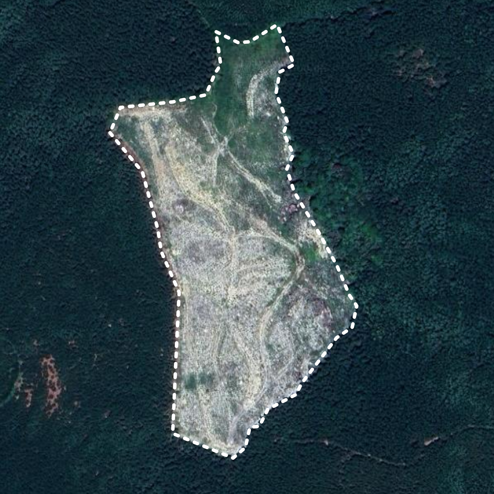
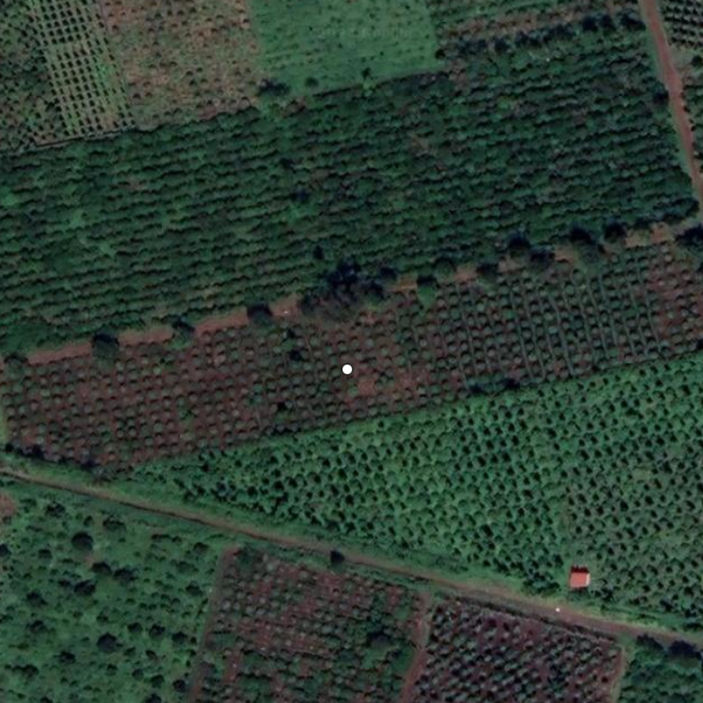

# Plot of Land

The plot of land is a key entity in the EUDR Risk Assessment and Mitigation. Each product must ensure that the plot of land where it was produced was not the result of deforestation or forest degradation as well as the geolocation is in accordance with the region-specific legislation (specifically, not in the area of Indigenous people or protected areas).

Open Atlas Vantage product provides an API to validate and organise information about plots of land. The plot of land could then be used to run a risk assessment.

# **Terminology overview**

The plot of land is defined in the EUDR Article 2:

> (27) ‘plot of land’ means land within a single real-estate property, as recognised by the law of the country of production, which enjoys sufficiently homogeneous conditions to allow an evaluation of the aggregate level of risk of deforestation and forest degradation associated with relevant commodities produced on that land;
> 

The plot of land is defined by its geolocation. The term is defined as:

> (28) ‘geolocation’ means the geographical location of a plot of land described by means of latitude and longitude coordinates corresponding to at least one latitude and one longitude point and using at least six decimal digits; for plots of land of more than four hectares used for the production of the relevant commodities other than cattle, this shall be provided using polygons with sufficient latitude and longitude points to describe the perimeter of each plot of land;
> 

# **Geometry Types**

Based on the definition of the geolocation, we can identify two geometry types that describe the plot of land:

- Polygon geometry for a plot of land larger than 4 hectares;
- Point or polygon geometry for a plot of land smaller than 4 hectares.

Geometry types are defined by the OpenGIS Simple Features Implementation Specification for SQL:

> A Point is a 0-dimensional geometry and represents a single location in coordinate space. A Point has a x-coordinate value and a y-coordinate value.
> 
> 
> A Polygon is a planar Surface, defined by 1 exterior boundary and 0 or more interior boundaries. Each interior boundary defines a hole in the Polygon.
> 

Open Atlas Vantage product uses the [GeoJSON geometry object specification](https://datatracker.ietf.org/doc/html/rfc7946#section-3.1) to describe geometry. GeoJSON is one of the geospatial data formats. It is the data format that is designed to be used by the [EU Information System to declare the performed due diligence](https://green-business.ec.europa.eu/deforestation-regulation-implementation/deforestation-due-diligence-registry_en).

# **Plots Examples**

<table>
  <tr>
    <td style={{ textAlign: 'center' }}>
      
      
Example of the Polygon Geometry - Vietnam

    </td>
    <td style={{ textAlign: 'center' }}>
      
      
Example of the Point Geometry - Vietnam

    </td>
  </tr>
</table>

# **Geometry Validity**

Producing geometry data often comes with a set of issues. Some of the issues are defined as invalid geometries; others could be valid, but problematic to process by some of the tools. Among other problematic geometries, the most common are geometries with holes, coordinates with the third dimension, and geometries with duplicated nodes.

Vantage runs the geometry validator when you register a plot. If the geometry is invalid, the API returns an error with details specified. If the geometry is valid, but problematic, Vantage allows registering the plot, but the analysis ignores some of the specifics of the geometry. For example, Vantage ignores the third dimension while running the risk assessment.

# **Plot of Land Properties**

While registering a plot of land, we ask to provide other information in addition to the geometry. This includes the `commodity` and the `harvest_date`.

The `commodity` value represents an EUDR in-scope commodity. Vantage supports the following commodity values: `wood`, `soy`, `cocoa`, `coffee`, `palm_oil`, `beef`, `rubber`.

The `harvest_date` represents the production time information required by EUDR. It is now represented as a single date. While running the risk assessment, this will be taken into account to perform the analysis in a time range between the 31st of December 2020 and the value in the `harvest_date`. If the value is not provided,

:::tip Information

Please note, if the harvest date is not provided for the plot, the current date will be used as the harvest date when running the risk assessment.

:::

The plot of land supports other properties that help better data organisation, including: `plot_name`, `notes`, `phone` and `owner`.